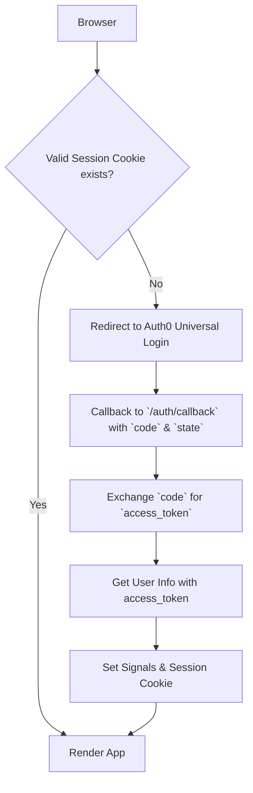

# Auth0 Solid Start (SSR compatible)

This is a fully functional library to add [Auth0](https://auth0.com) OAuth
Authentication to a [Solid-Start](https://github.com/solidjs/solid-start) App.

You'll need to sign up and create an Auth0 Application to use this library. The
credentials are stored in an `.env` file (see [.env.example](./env.example)).

This work is inspired by

- Ryan Turnquist [solid-auth0](https://github.com/rturnq/solid-auth0)
- Sergio Xalambrí
  [remix-auth-oauth2](https://github.com/sergiodxa/remix-auth-oauth2)

## How it works

This library is intended to be used on `root` level of your Solid-Start App. It
provides an authentication context for the entire App. Users/passwords etc. are
all stored in Auth0, we use the Universal Login Experience to authenticate users
and get a `code`, which we can exchange for an `access_token`. The
`access_token` is a valid JWT token and can be used to authenticate requests to
your API / GraphQL /etc.

The callback URL is set to `/auth/callback`, so you need to create an API route
in `src/routes/auth/callback.js/ts`. The code can be found below.



## Multi Tenant Mode

Multi Tenant Mode can be used with
[Auth0 Organizations](https://auth0.com/docs/manage-users/organizations). You'll
have to pass an organization object into the Auth0 context with an `id`. We
recommend using the same schema as Auth0.

Set `VITE_AUTH0_REWRITE_REDIRECT=true` in `.env`

## Usage

### Environment Variables

See [.env.example](./env.example)

- `VITE_AUTH0_REWRITE_REDIRECT` requires the Auth0 Organization setup
- `VITE_AUTH0_OFFLINE_ACCESS` requires the Auth0 API to be configured with
  offline access
- `VITE_AUTH0_LOGOUT_URL` the logout url (a server-side route, ie
  http://localhost:8080/auth/logout)

### vite.config.ts/js

There's an issue with vite throwing `process` is undefined errors when the
session is loaded on the client. To fix this, add the following to your
`vite.config.ts/js`:

```js
define: {
    'process.env': process.env
  },
```

### root.jsx / .tsx

In `root.tsx` to enforce authentication on all pages:

```jsx
import { Show, Suspense } from 'solid-js'
import { isServer } from 'solid-js/web'
import { ErrorBoundary, FileRoutes, Routes } from 'solid-start'
import { Auth0, useAuth0 } from '@zentered/auth0-solid-start'

const GraphQLProvider = () => {} // let's assume you want to authenticate graphql requests with your JWT

function Login(props) {
  return (
    <div>
      <p>Sign in</p>
      <div>
        <div>
          <a onClick={() => props.auth0.authorize()} type="button">
            Log In
          </a>
        </div>
      </div>
    </div>
  )
}

function SiteRequiresAuth(props) {
  const auth0 = useAuth0()

  if (!auth0.isAuthenticated() && !isServer) {
    auth0.login()
  }

  return (
    <>
      <Show when={auth0.isInitialized()}>
        <Show when={auth0.isAuthenticated()} fallback={<Login auth0={auth0} />}>
          <Show when={auth0.accessToken()}>
            <GraphQLProvider auth0={auth0}>{props.children}</GraphQLProvider>
          </Show>
        </Show>
      </Show>
    </>
  )
}

export default function Root() {
  return (
    // ...
    <Suspense>
      <ErrorBoundary>
        <Auth0
          domain={import.meta.env.VITE_AUTH0_DOMAIN}
          clientId={import.meta.env.VITE_AUTH0_CLIENT_ID}
          audience={import.meta.env.VITE_AUTH0_AUDIENCE}
          redirectUri={import.meta.env.VITE_AUTH0_REDIRECT_URI}
          logoutUrl={`${import.meta.env.VITE_BASE_URL}/auth/logout`}
          // organization={organization} // uncomment if you use auth0 organizations
        >
          <SiteRequiresAuth>
            <Routes>
              <FileRoutes />
            </Routes>
          </SiteRequiresAuth>
        </Auth0>
      </ErrorBoundary>
    </Suspense>
    // ...
  )
}
```

### Logout

The logout happens in 3 steps:

1. User clicks "Sign out" and starts the process
2. `logout` function on the Auth0 Provider is triggered that generates an
   [auth0 logout url](https://auth0.com/docs/authenticate/login/logout/log-users-out-of-applications)
3. Auth0 redirects back to the "logout url" which clears the session.

There are two parts: the logout function in the auth0 provider and the "api"
route (ie `/auth/logout`), see below.

In any component/page where you want the "Sign out" link:

```jsx
import { useAuth0 } from '@zentered/auth0-solid-start'
import { Link } from '@solidjs/router'

export default function Component() {
  const auth0 = useAuth0()
  const [, logout] = createRouteAction(async () => {
    await auth0.logout()
  })

  <Link
    href="#"
    class={`button`}
    onClick={() => logout()}
  >
    Sign Out
  </Link>
}

```

### API

#### Callback

`routes/auth/callback.js|ts`:

```js
import fn from '@zentered/auth0-solid-start/api/callback'

export async function GET({ request }) {
  return fn(request)
}
```

#### Logout API

`routes/auth/logout.js|ts`:

```js
import fn from '@zentered/auth0-solid-start/api/logout'

export function GET({ request }) {
  return fn(request)
}
```

## Development

You can fork/clone this repository and link it into your working project with
`pnpm link`:

```bash
cd auth0-solid-start
pnpm link

cd ../your-project
pnpm link @zentered/auth0-solid-start ../../auth0-solid-start
```

Instead of using the `npm` version you're now working with a local copy. Changes
in the `auth0-solid-start` folder _should_ restart the app.
